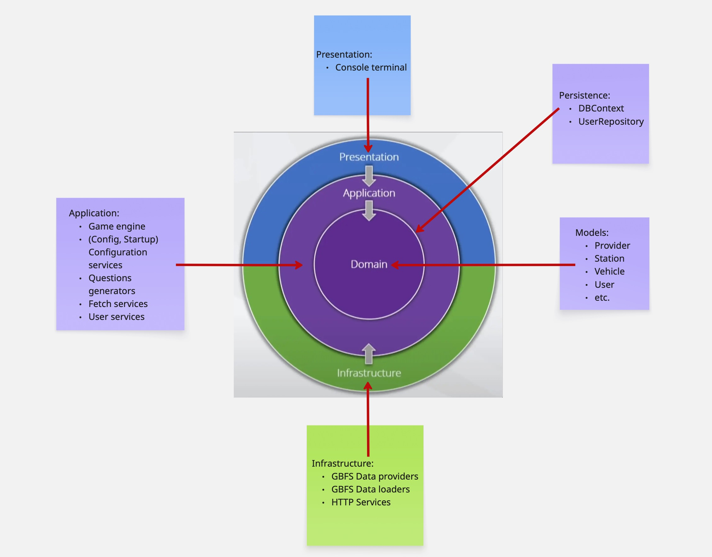

# FunWithGBFS

**FunWithGBFS** is a modular and extensible quiz game powered by real-time GBFS (General Bikeshare Feed Specification) data. It challenges users to answer questions about bike station and vehicle availability using live data from public bike-sharing systems around the world.

---

## Features

- Connects to live GBFS endpoints for bike station and vehicle data
- Generates multiple-choice quiz questions about station or vehicle availability
- Asynchronous game timer with cancellation and event support
- Modular, testable architecture using dependency injection and interfaces
- Clean separation of concerns: data, logic, and UI layers
- Console-based UI with future support for Web and Mobile

---

## Build and Run Instructions

### Requirements

- [.NET 8 SDK](https://dotnet.microsoft.com/en-us/download)
- IDE or editor of your choice (Visual Studio, Rider, or VS Code)

### Build

```bash
git clone https://github.com/khalimovaelena/FunWithGBFS.git
cd FunWithGBFS
dotnet restore
dotnet build
```

### Run
```bash
dotnet run
```

Configuration is handled via [appsettings.json](https://github.com/khalimovaelena/FunWithGBFS/blob/main/FunWithGBFS/Config/appsettings.json) . Ensure the GBFS URLs are valid and accessible.

## Architecture Overview and Rationale
I chose Clean architecture principles for this project to ensure that solution is scalable, maintanable, testable and will be easy to improve in the future.
Architecture layers and classes related to them are shown in the picture below:


### Presentation Layer
I chose Console terminal as default user interface, because it doesn't require any additional setup and external dependencies.
At the same time Presentation layer is separated from game logic, which will allow to change UI in the future to Web, Mobile, or API-based UI (that can be used by chatbots).

### Application Layer

#### Game logic
Contains the main game logic (GameEngine), necessary settings (GameSettings), asynchronous timer (GameTimer) and ScoreManager for tracking user scores.
GameTimer allows to start one async timer per game (console) instance, which allows to run multiple games concurrently in different console windows.
Main game settings are configurable via appsettings.json and GameSettings class that allows to change game parameters without code changes.

#### 2. Question generation
Contains general interface IQuestionGenerator that allows to generate different kinds of questions and add them to the game without changing much in the code.
To add new question, just implement IQuestionGenerator interface and add it to Program.cs.
Right now all questions are hardcoded (each question is represented by a class that implements IQuestionGenerator). This architecture was chosen to be able to easy and quickly implement questions without complicated logic, which should be enough for test project.
I described  desired (for production) architecture of questions generators in Future Improvements section below.

#### 3. Startup and Dependency Injection
Application configuration and dependency injection are separated from Program.cs into separate classes (AppConfigurator and ServiceConfigurator classes).

### Infrastructure Layer

#### Data Providers
Use HttpClient to fetch live GBFS data from public bike-sharing systems via REST APIs.

#### Data Mappers
Translate deserealized JSON provided by related provider directly to internal models (Station, Vehicle, etc.) that can be used in question generators to create questions and options.

### Persistence Layer
Contains GameDBContext and Repositories (currently only UserRepository) to store data. 
As this is test project and it doesn't need to store big amounts of complicated data, SQLLite DB should be enough. It is a lightweight database that can be instanciated on the app run, but for production uses it can be replaced with full-featured DB like PostgreSQL, Oracle or MS SQL.

### Domain Layer
Contains domain models (Station, Vehicle, Question, Option) that represent the core data structures used in the game. 

### Logging
Microsoft.Extensions.Logging package is used for logging throughout the application. 
It provides a standardized way to log messages and errors without using external dependencies and doesn't need extra configuration.
For production, we might need to add audit logs and information for analytics, performance tracking and users investigations. 

## Future Improvements
### 1. Token Authentication for Users
- Add JWT or OAuth2-based authentication
- Track users securely with token-based session management
- Enable user registration, login, and roles (e.g., admin/player)

### 2. API-first Architecture
- Add REST API for game engine and questions generating to be able to connect to them from various UIs: web, mobile, chatbots, external websites, etc.
- Enable support for:
	- Web apps
	- Mobile apps
	- Chatbot interactions
- Allow multiple clients to connect concurrently (multiplayer mode)
*(\* Right now concurrency is achieved by running multiple instances of the console app)**

### 3. Store Questions in a Database
- Save every generated question and user response
- Enable auditing, performance tracking, and analytics
- Useful for teachers, researchers, and competitive leaderboards

### 4. Question Generating Platform
- Create a table in DB or JSON configuration (or any other type of structure that can contain parameters) to define question generation rules
- Parameters might include:
	- Location (city/region)
	- Question text
	- Question type (single/multiple choice, true/false etc))
	- Data input type (station/vehicle etc)
	- Thresholds (what to calculate: min/max/avg etc)
	- Which fields in external API relate to which data of the question (where to read number of bikes, disabled/reserved bikes etc from)

Basic logic will be coded: 
- how to calculate Thresholds (max, min, average values etc) 
- how to generate options for single/multiple choice questions

Then game admins will be able to add parameters for new questions without code changes.
Game logic will dynamically read and apply these parameters (from DB or json) to generate new questions.

### 5. Persistent Storage 
- Replace SQLLite with full-featured DB (PostgreSQL, Oracle, MS SQL) to be able to create users roles (admin/player), store statistics and provide more advance analytics.

### 6. More Unit Tests 
- Add tests for GameEngine, Data Providers etc

### 7. Multiplayer Support 
- Implement real-time multiplayer quiz sessions

### 8. Localization
- Add multi-language support

### 9. Admin Dashboard
- For adding rules, managing questions, or viewing game statistics

### 10. More fun features for gamers
- Leaderboards, achievements, and social sharing
- Profile customization and user settings
- Perks for top players (e.g., discounts on bike rentals, etc.)
- Nice UI and voiceover for questions and answers

## New Features implemented:
1. You start with below 0 scrore (-50/-100) and if you reach 0, you have level 1, and if you not reach 0, you loose.
1. If you answer 2 questions wrong, you loose.

## Suggestions for improvement:
1. For production Model can store more logic, then Application layer can be thinner.
1. Exception handling is too advanced, bugs might be hidden because of that. We can remove unnecessary try/catch blocks.
1. GameEngine has too many if-else, we can move conditions for ending the game to separate class.